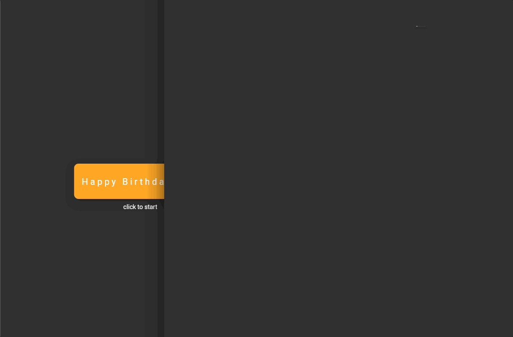
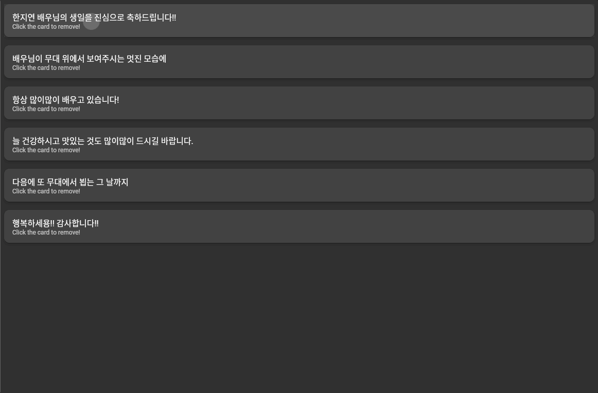
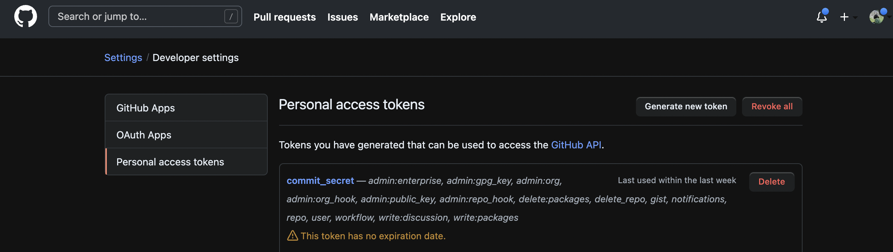
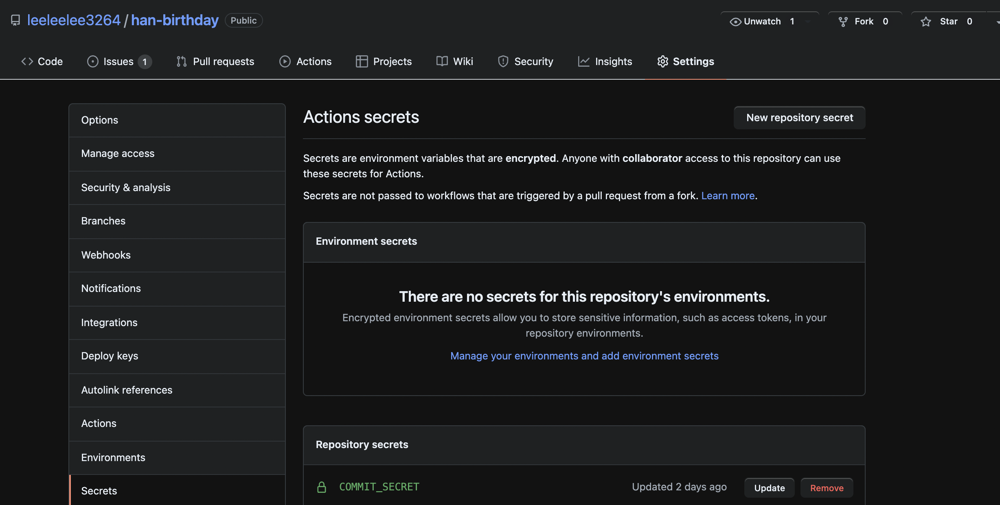
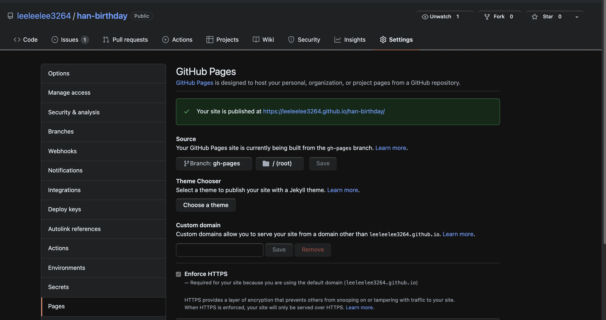

# han_birthday

# Very simple birthday page with Flutter and github page

Able to see live demo here [birthday page](https://leeleelee3264.github.io/han-birthday/build/web/#/)
 

Made a very simple birthday celebration page with Flutter and github page. Main goals were down below. 

- Use Flutter
- Use many animation as possible
- Deploy to github page.

<br>

Main Opening animation


List loading animation 



List popup animation 



<br> 
<br> 


## Development stack

| stack | info |
| --- | --- |
| Frontend Language | Dart |
| Frontend Framework | Flutter |
| Page hosting | Github page  |
| Deploy | Github action  |

<br>
<br> 

## Deploy Flutter to github page

```yaml
name: HAN
on:
  push:
    branches:
      - master
jobs:
  build:
    name: Build Web
    env:
      my_secret: ${{secrets.commit_secret}}
    runs-on: ubuntu-latest
    steps:
      - uses: actions/checkout@v1
      - uses: subosito/flutter-action@v1
        with:
          channel: 'dev'
      - run: flutter config --enable-web
      - run: flutter pub get
      - run: flutter build web --release --no-sound-null-safety
      - run: |
            cd ./build/web
            git config --global user.email absinthe4902@naver.com
            git config --global user.name leeleelee3264
            git remote set-url origin https://${{secrets.commit_secret}}@github.com/leeleelee3264/han-birthday.git
            git checkout -b gh-pages
            touch empty_file_trigger
            date >> empty_file_trigger
            git status
            git add .
            git commit -m "update"
            git push origin gh-pages -f
```

### How to Delpoy flutter to github page

Do this basic setting in local and push before making github action


```bash
flutter channel master
flutter upgrade
flutter config --enable-web
flutter create . (<- . 점 현재 디렉토리 까지 선택)

# to check running page 
flutter devices
flutter run -d chrome 

# final step, build flutter app for web 
flutter build web

```
<br>

Github Action part


```yaml
    steps:
      - uses: actions/checkout@v1
      - uses: subosito/flutter-action@v1
        with:
          channel: 'dev'
      - run: flutter config --enable-web
      - run: flutter pub get
      - run: flutter build web --release --no-sound-null-safety
      - run: |
            cd ./build/web
      # git action command down below 
```

- I used https://github.com/subosito/flutter-action action to build flutter.
- No need to add —no-sound-null-safety if every dependencies support null safety.
- Build directory for Flutter web will be generated path `./build/web`
- Therefore, page url for the github page will be `{my_githubpage}{repo}/build/web`
In my case, [https://leeleelee3264.github.io/han-birthday/build/web](https://leeleelee3264.github.io/han-birthday/build/web/#/)

<br>

### How to use personal access token to push to my github repo

1. Go to github setting > Developer Setting > Personal Access tokens 
2. Genrate token with propal permissions (in this example, token name is commit_secret)



3. Go to project repository > settings > secrets 
4. Add Repository with Generated token in step 2. (in this example, secret name is COMMIT_SECRET) 



5. Now we can use the issued token like this. 

```bash
git remote set-url origin https://${{secrets.commit_secret}}@github.com/leeleelee3264/han-birthday.git
```

<br>

### Enable github action page for this repository

1. Go to project repository > pages 
2. Set branch for github page. 



```bash
      - run: |
            cd ./build/web
            git config --global user.email absinthe4902@naver.com
            git config --global user.name leeleelee3264
            git remote set-url origin https://${{secrets.commit_secret}}@github.com/leeleelee3264/han-birthday.git
            git checkout -b gh-pages
            touch empty_file_trigger
            date >> empty_file_trigger
            git status
            git add .
            git commit -m "update"
            git push origin gh-pages -f
```

In my case, I made github page purpose branch `gh-pages` in action yaml to seperate real source code in master branch. **After build action, several build files are generated only in gh-pages.** 

<br>
<br>

## Source code exp.

Leave typing animation code here to use later. 

text_writer_text.dart 

```dart
import 'package:flutter/material.dart';
import 'package:simple_animations/simple_animations.dart';
import 'package:supercharged/supercharged.dart';

class TypeWriterText extends StatelessWidget {
  static const Type_Writer_STYLE =
  TextStyle(letterSpacing: 5,
      fontSize: 20, fontWeight:
      FontWeight.w400,
      color: Colors.white);

  final String text;
  TypeWriterText(this.text);

  @override
  Widget build(BuildContext context) {
    return PlayAnimation<int>(
        duration: 1000.milliseconds,
        delay: 1000.milliseconds,
        tween: 0.tweenTo(text.length),
        builder: (context, child, textLength) {
          return Row(
            mainAxisAlignment: MainAxisAlignment.center,
            children: [
              Text(text.substring(0, textLength),
                  style: Type_Writer_STYLE
              ),
              _blinkingCursor()
            ],
          );
        });
  }

  Widget _blinkingCursor() {
    return LoopAnimation<int>(
      duration: 800.milliseconds,
      tween: 0.tweenTo(1),
      builder: (context, child, oneOrZero) {
        return Opacity(
            opacity: oneOrZero == 1 ?
            1.0 : 0.0,
            child: Text("_", style:
            Type_Writer_STYLE)
        );
      },
    );
  }
}
```

- Code for TypeWriterText component.
- Blink cursor widget is added for the component.

main.dart 

```dart
import 'package:flutter/material.dart';
import 'package:han_birthday/list.dart';
import 'package:han_birthday/text_writer_text.dart';
import 'package:simple_animations/simple_animations.dart';
import 'package:supercharged/supercharged.dart';

void main() {
  runApp(MyApp());
}

class MyApp extends StatelessWidget {
... 
}

class TypeWriterBox extends StatefulWidget {
  static final boxDecoration = BoxDecoration(
      color: Colors.orange[400],
      borderRadius: BorderRadius.all(Radius.circular(10)),
      boxShadow: [
        BoxShadow(
            color: Colors.black.withAlpha(50),
            blurRadius: 15,
            offset: Offset(0, 8),
            spreadRadius: 5)
      ]);

  const TypeWriterBox({Key? key}) : super(key: key);

  @override
  _TypeWriterBoxState createState() => _TypeWriterBoxState();
}

class _TypeWriterBoxState extends State<TypeWriterBox> {
  @override
  Widget build(BuildContext context) {
    return Scaffold(
      body: SizedBox(
        width: double.infinity,
        child: Column(
            mainAxisAlignment: MainAxisAlignment.center,
            crossAxisAlignment: CrossAxisAlignment.center,
            children: [
              PlayAnimation<double>(
                duration: 400.milliseconds,
                tween: 0.0.tweenTo(80.0),
                builder: (context, child, height) {
                  return PlayAnimation<double>(
                    duration: 1600.milliseconds,
                    delay: 500.milliseconds,
                    tween: 2.0.tweenTo(300.0),
                    builder: (context, child, width) {
                      return GestureDetector(
                        onTap: () {
                          Navigator.push(
                            context,
                            MaterialPageRoute(builder: (context) => MyApp2()),
                          );
                        },
                        child: Container(
                          decoration: TypeWriterBox.boxDecoration,
                          width: width,
                          height: height,
                          child: typewriter(width)
                              ? TypeWriterText("Happy Birthday Prj")
                              : Container(),
                        ),
                      );
                    },
                  );
                },
              ),
              Container(
                  margin: EdgeInsets.all(10),
                  child: Text("click to start"),
              ),
            ]),
      ),
    );
  }

  bool typewriter(double width) => width > 15;
}
```

- Caller for TypeWriterText component.
